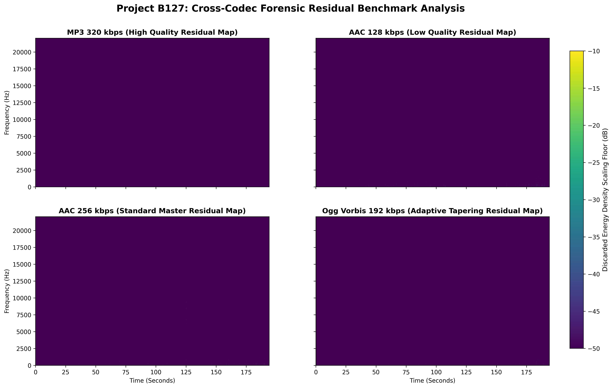

# Project B127


B127 is a specialized forensic digital signal processing application designed to expose and visualise exactly what lossy
audio encoders like MP3, AAC, or Ogg Vorbis throw away during compression.

When audio is compressed into these formats, algorithms permanently delete data that the human ear allegedly cannot
perceive. B127 acts as an audio archeologist. It takes a perfect, lossless reference file like a FLAC and its compressed
counterpart, mathematically aligns them down to the exact sample to eliminate time delays, converts both into the
frequency domain, and subtracts them.

The resulting visual map, known as a **spectral residual**, isolates the ghost data, which represents the precise
frequencies and acoustic footprints that the compression engine deemed unnecessary.

---

## The Problem

The fundamental problem B127 addresses is lossy data reduction transparency.

Psychoacoustic models operate on the principle of auditory masking. If there is a loud sound at 1 kHz, your brain cannot
hear a quieter sound at 1.1 kHz occurring at the same time. Lossy encoders exploit this limitation to save file space by
stripping out the hidden, masked frequencies.

However, verifying exactly how these encoders alter audio, or analyzing the deterministic artifacts they leave behind,
is incredibly difficult because lossy encoders introduce minute, random padding samples at the start of a file, an
effect called **stream head priming**. This shifts the timeline slightly.

Without correcting this phase misalignment, a direct file comparison results in chaotic noise rather than a precise
profile of the discarded data. B127 solves this synchronization problem to isolate the exact psychoacoustic masking
threshold used by the encoder.

---

## The Continuous Waveform

Sound begins as a physical phenomenon consisting of longitudinal pressure waves propagating through a medium. These
fluctuations in air pressure can be modeled as a continuous function of time, denoted as x(t). A pure tone is a simple
sinusoidal oscillation, but real world audio such as a vocal track or a cymbal strike is a highly complex superposition
of countless frequencies changing dynamically over time.

## Sampling and Quantization

To process this continuous acoustic wave on digital infrastructure, it must undergo Analog to Digital Conversion via two
distinct operations.

### Sampling (Time Domain Discretization)

The continuous signal is measured at uniform intervals of time. According to the Nyquist Shannon sampling theorem, to
perfectly reconstruct a signal containing frequency components up to a maximum frequency f
max
$$\text{Nyquist Frequency} = \frac{f_s}{2}$$

For human hearing, which caps out around 20 kHz, a standard sampling rate of 44.1 kHz or 48 kHz is used to capture the
entire audible spectrum without aliasing distortion.

### Quantization (Amplitude Domain Discretization)

The continuous amplitude at each sample point is mapped to the nearest discrete value within a fixed bit depth. A 16 bit
lossless PCM audio stream provides 2^16 (65,536) discrete amplitude levels, yielding a dynamic range of approximately 96
dB.

## The Short Time Fourier Transform (STFT)

While raw digital audio is stored as a sequence of time domain amplitudes, our brains perceive audio through its
constituent frequencies. To analyze this computationally, we use the Fourier Transform.
Because audio is non stationary meaning its frequency content changes over time, applying a standard Fourier
Transform over an entire track would strip away all temporal information. Instead, B127 utilizes the Short Time
Fourier Transform. The Short Time Fourier Transform segments the continuous time domain signal into short, overlapping
blocks using a window function such as a Hann window to minimize spectral leakage at the boundaries. For each discrete
window frame, the Discrete Fourier Transform is computed via the Fast Fourier Transform algorithm:

$$X(m, \omega) = \sum_{n=-\infty}^{\infty} x[n] \cdot w[n - mR] \cdot e^{-j\omega n}$$

### where:

* **$x[n]$** represents the discrete time domain input signal.
* **$w[n]$** represents the window function shifted by hop size $R$.
* **$m$** represents the time frame index.
* **$\omega$** represents the discrete frequency bin.

## Nyquist Sampling Theory and The 44.1 kHz Standard

To understand why these files are structured this way, we have to look at how continuous, real world analog sound waves
are converted into discrete digital numbers.

### The Nyquist Shannon Sampling Theorem

The theorem states that to perfectly reconstruct an analog signal without distortion, the sampling rate ($f_s$) must be
greater than twice the highest frequency component ($f_{max}$) present within that signal.

$$f_s > 2 \cdot f_{max}$$

The highest frequency that a given digital sampling rate can accurately capture is called the **Nyquist Frequency**:

$$\text{Nyquist Frequency} = \frac{f_s}{2}$$

If an analog signal contains frequencies higher than the Nyquist Frequency when it is sampled, those high frequencies
fold back into the lower spectrum. This creates a destructive type of digital distortion called **aliasing**, which
manifests as false lower frequencies that were not there in reality.

## Psychoacoustics and the Mechanics of Lossy Codecs

Lossless formats like Free Lossless Audio Codec (FLAC) use entropy coding to reduce file sizes without altering a single
bit of the original Pulse Code Modulation data. Lossy codecs achieve radical file size reductions by deliberately
discarding audio data. They do this by exploiting the biological limitations of human auditory perception via
psychoacoustic masking models.

### Absolute Threshold of Hearing

The human ear does not perceive all frequencies equally. Sensitivity peaks sharply between 2 kilohertz and 5 kilohertz,
and drops off drastically toward 20 kilohertz. Codecs exploit this by heavily attenuating or completely truncating
frequencies above 16 kilohertz to 18 kilohertz as very few adults can perceive those frequencies.

### Simultaneous Masking

When a powerful, high amplitude frequency component is present, it creates a localized masking curve in the cochlea.
Quieter spectral components immediately adjacent to this dominant frequency become physically inaudible to the human
brain. The encoder calculates these masking thresholds per frame and zeroes out any spectral data falling below the
curve.

### Temporal Masking

Human auditory processing has a temporal latency. When a sudden, intense acoustic shock occurs, quiet sounds immediately
preceding it and following it are masked by the brain. Codecs alter their window sizes dynamically to drop data during
these temporal windows.

### Why CDs Use 44.1 kHz for Human Hearing

The standard human hearing range is universally accepted to be between 20 Hz and 20,000 Hz (20 kHz).

To digitalize the absolute upper limit of human hearing (20 kHz) without aliasing, the absolute bare minimum sampling
rate required by the Nyquist theorem is:

$$2 \cdot 20 \text{ kHz} = 40 \text{ kHz}$$

CD engineers settled on 44.1 kHz instead of a clean 40 kHz due to two primary engineering reasons:

1. **Anti Aliasing Filter Transition Bands:** In the early days of digital audio, analog low pass filters were used
   before the sampling phase to aggressively cut off any frequencies above 20 kHz so they would not cause aliasing. Real
   world filters cannot drop off like a perfectly sharp brick wall. They require a physical slope or transition zone to
   roll off smoothly from 0 dB to total silence. The extra 4.1 kHz of headroom, which is the space between 20 kHz and
   22.05 kHz, provides a safety buffer for the analog filters to attenuate the signal completely without damaging the
   audible frequencies under 20 kHz.
2. **Video Format Compatibility:** When Compact Discs were being standardized in the late 1970s and early 1980s by Sony
   and Philips, digital audio data had to be stored on modified industrial video tape recorders because digital disk
   storage did not exist yet. The video standards of the era were PAL running at 50 Hz and NTSC running at 60 Hz.
   Engineers needed a sampling frequency that could cleanly map across both video formats without complex fractional
   math.

* **For PAL:
  ** $$\text{294 lines per frame} \times \text{3 samples per line} \times \text{50 frames per second} = 44,100 \text{ Hz}$$
* **For NTSC:
  ** $$\text{245 lines per frame} \times \text{3 samples per line} \times \text{60 frames per second} = 44,100 \text{ Hz}$$

Thus, 44.1 kHz became the perfect mathematical bridge that satisfied both the biological requirements of human hearing
and the limitations of early digital hardware components.

### Testing

To test this software project, run python3 main.py

```bash
python3 main.py

```

### sample Results

My person test on my computer


Also, the current flac audio file in the test bench folder.
If you're cloning to run on your computer. These are things to Note

1. The test bench image will always be overwritten when a new flac file is tested
2. The code_comparison_residual image will definitely change.



Thank You
Michael Awoniran

